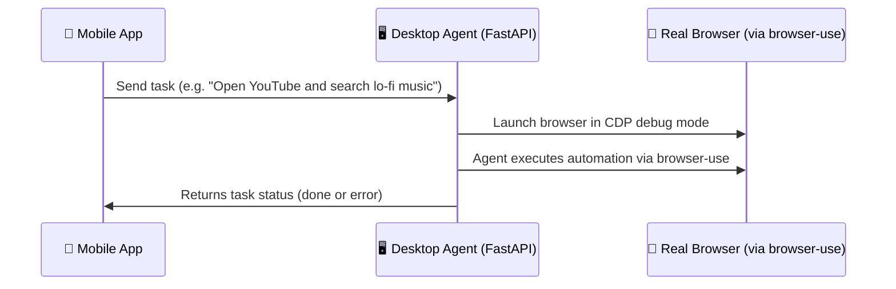

🌐 Browser Agent Mobile

Remotely control your desktop browser using natural language — via a mobile app and an AI-powered automation agent.

> ✨ Built with [`browser-use`](https://github.com/browser-use/browser-use), **FastAPI**, **LangChain**, and powered by [Briefcase](https://beeware.org/project/projects/tools/briefcase/) for cross-platform packaging.

---

## 🧠 Overview

**Browser Agent Mobile** is a two-part project:

- 🖥️ **Desktop Agent App**  
  A cross-platform app that runs an AI agent using `browser-use`, which automates a local browser (e.g., Chrome) using natural language tasks.

- 📱 **Mobile Chat Controller**  
  A React Native (Expo) mobile app to send commands and interact with the AI assistant on your desktop.

---

## 🧩 How It Works



---

---
## Demo


---

## 🚀 Getting Started

### 🖥️ Desktop Agent App

#### ❗ Requirements

- Python 3.10+
- Chrome browser
- [`briefcase`](https://beeware.org/project/projects/tools/briefcase/) CLI installed:  
  ```bash
  pip install briefcase
  ```

#### 📦 Install & Run Locally

```bash
cd browser-agent-app
briefcase dev
```

#### 🛠 Build Cross-Platform Executable

```bash
briefcase build
briefcase run
```

Or package into a standalone distributable:

```bash
briefcase package
```

#### 🔑 Setup

The app launches a GUI where you can:


- Choose a browser
- Start the FastAPI agent server

All automation is powered by [`browser-use`](https://github.com/browser-use/browser-use), a powerful agent-driven browser controller.

---

### 📱 Mobile App (Expo)

#### ✅ Requirements

- Node.js
- `expo-cli`: `npm install -g expo-cli`
- Expo Go installed on your mobile phone

#### 🔧 Setup & Run

```bash
cd BrowserUseMobile
npm install
npx expo start
```

> Scan the QR code from your phone’s Expo Go app.

First-time setup will ask for:

- OpenAI API key
- Model (e.g., `gpt-4o`)
- Server URL (e.g., `http://192.168.0.x:8000`)

---

## 🧪 Example Task

From the mobile app or using `curl`, you can send:

```bash
curl -X POST http://localhost:8000/run-task \
  -H "Content-Type: application/json" \
  -d '{"task": "open google.com"}'
```

The desktop app will launch Chrome in debug mode and complete the task using the AI agent.

---

## 💻 Project Structure

```
/
├── browser-agent-app/
│   ├── src/BrowserUseMobile/      # Briefcase-compatible desktop app
│   ├── main.py                    # Tkinter GUI launcher
│   ├── agent_runner.py            # FastAPI server + agent logic
│   └── pyproject.toml             # Briefcase configuration
│
├── mobile-app/
│   └── App.tsx                    # Expo mobile chat UI
```

---

## 🧠 Powered By

| Component     | Description                                                |
|---------------|------------------------------------------------------------|
| 🧪 [`browser-use`](https://github.com/browser-use/browser-use) | Natural-language browser automation (Chrome + CDP) |
| 💬 LangChain  | Agent reasoning & planning engine                          |
| 🌐 FastAPI    | API server on desktop to receive tasks                     |
| 🖼️ tkinter    | Desktop GUI for configuration                              |
| 📱 React Native (Expo) | Chat interface to communicate with the agent      |
| 📦 Briefcase  | Build system for creating .app, .exe, .deb, etc.           |

---

## 🌍 Cross-Platform Support

Thanks to **Briefcase**, this desktop agent is designed to work on:

- macOS `.app`  
- Windows `.exe`  
- Linux (Debian, Arch, RHEL, SUSE, AppImage)  
- Android (via `toga-android`)
- iOS (via `toga-ios`)
- Web (via `toga-web`)

All configurations are declared in `pyproject.toml`.

---

## 🔐 Local-First by Design

- No cloud server
- All API keys are stored locally (`.env` on desktop / secure storage on mobile)
- Communication is only between your mobile and your computer over the same network

---

## 🤝 Contributing

We welcome contributions of all kinds — code, UX, testing, docs.

### 📋 How to Contribute

1. Fork the repo
2. Create a branch (`feat/my-feature`)
3. Make your changes
4. Open a Pull Request 🚀

---

## 📄 License

MIT License — Free to use, modify, and distribute.

---

## 🧭 Links

- `browser-use`: https://github.com/browser-use/browser-use  
- Briefcase: https://beeware.org/project/projects/tools/briefcase/  
- LangChain: https://github.com/langchain-ai/langchain  
- Expo: https://expo.dev  
- OpenAI API: https://platform.openai.com  

---

> Built with 🧠 automation + ❤️ local-first principles.  
> You own your AI agents.

---

'give me in code format'
